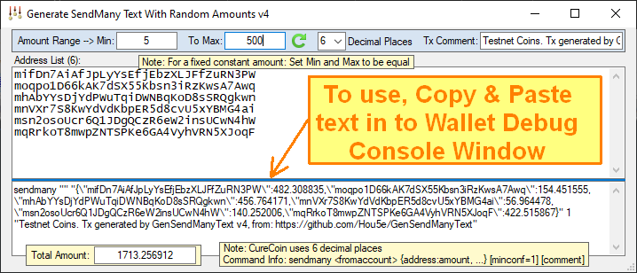

# Generate SendMany Text With Random Amounts

## Features
- Simple SendMany command text generator for use with Bitcoin-like wallets (CureCoin) for giveaways or airdrops
- Just copy and paste the generated text into the wallet's: Help | Debug Window | Console tab
- Creates random amounts based on the specified range of values to 6 or 8 decimal places
- Creates fixed constant amounts if the Min and Max are the same value
- Auto-regenerates on changes or pressing the regenerate button, and displays the total amount to distribute
- Specify a comment for the transaction
- Supports CTRL+A to Select All text

## Releases
- **See [GenSendManyText Releases](https://github.com/Hou5e/GenSendManyText/releases) for the Windows executable**
- **Please ask questions on the Discord Contact links below**
- GenSendManyText is written in VB.NET, compiled with VS2015, targeting the .NET Framework v4.6.1

## FAQ
- CureCoin uses 6 decimal places, and other coins like Bitcoin use 8 decimal places
- If you get: "Account has insufficient funds (code -6)"
  * Check if the wallet name to use was specified, otherwise leave it blank.
  * Check the total being used is not exceeding the wallet balance.

## License
- GenSendManyText is public domain licensed under [The Unlicense](LICENSE "The Unlicense")

## Contact
**Please ask questions on Discord (I'm user Hou5e):**
  * [FoldingCoin Discord Invite](https://discord.gg/CvZ7gAs)
  * [CureCoin Discord Invite](https://discord.gg/jtztkFZ)
  * See Websites: [FoldingCoin](http://foldingcoin.net/) & [CureCoin](http://curecoin.net/) 